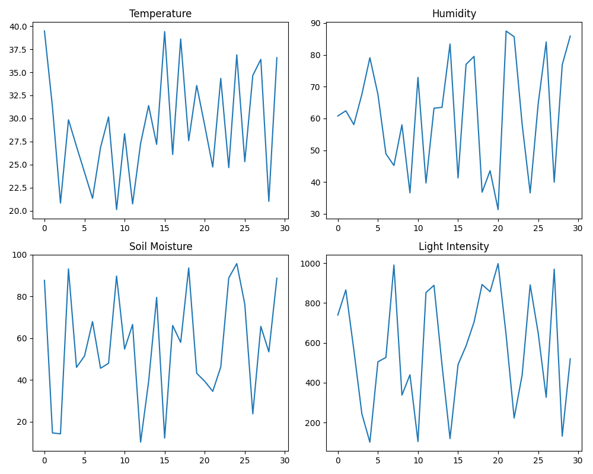
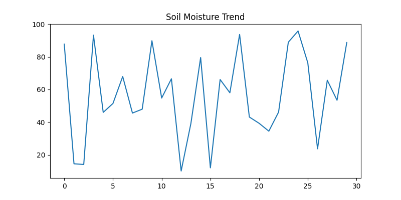
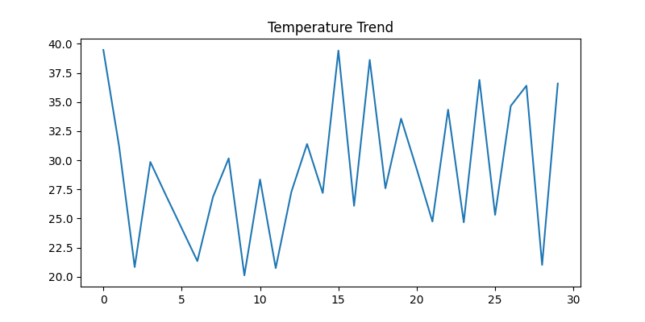
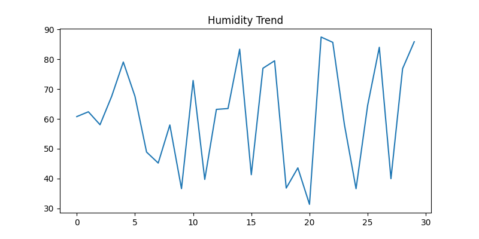
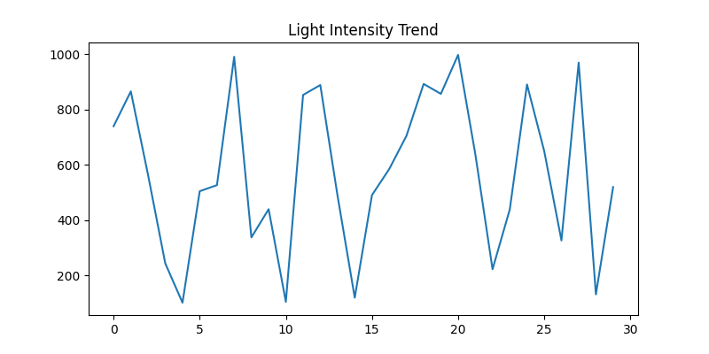

# 🌱 IoT Smart Agriculture Monitoring System

## 📌 Project Overview

The IoT Smart Agriculture Monitoring System is a Python-based simulation project designed to monitor key agricultural parameters such as soil moisture, temperature, humidity, and light intensity. The system analyzes environmental conditions, automates irrigation decisions, logs sensor data, and generates visual reports for better farm monitoring and resource management.

This project demonstrates how IoT concepts can be applied in agriculture to improve productivity, optimize water usage, and support data-driven farming decisions.

---

## 🚀 Features

* Real-time sensor data simulation
* Soil moisture monitoring
* Temperature monitoring
* Humidity monitoring
* Light intensity monitoring
* Automated irrigation control
* Alert generation for abnormal conditions
* CSV-based data logging
* Graph generation and visualization
* Dashboard summary report
* IoT-based agriculture monitoring workflow

---

## 🛠️ Technologies Used

* Python
* Pandas
* Matplotlib
* CSV Data Storage
* IoT Concepts
* Arduino (Conceptual Implementation)

---

## 📂 Project Structure

```text
IoT-Smart-Agriculture-Monitoring-System/
│
├── main.py
│
├── arduino_code/
│   └── smart_agriculture.ino
│
├── python_simulation/
│   ├── sensor_simulator.py
│   ├── irrigation_controller.py
│   ├── alert_system.py
│   └── graph_generator.py
│
├── data/
│   └── sensor_data.csv
│
├── outputs/
│   ├── alerts_log.txt
│   └── pump_status_log.txt
│
├── images/
│   ├── moisture_trend.png
│   ├── temperature_trend.png
│   ├── humidity_trend.png
│   ├── light_intensity_trend.png
│   └── dashboard_summary.png
│
├── docs/
│
├── README.md
├── requirements.txt
└── .gitignore
```

---

## ⚙️ Installation

### Install Dependencies

```bash
pip install -r requirements.txt
```

---

## ▶️ How to Run

### Step 1: Generate Sensor Data

```bash
python main.py
```

### Step 2: Generate Visual Reports

```bash
python python_simulation/graph_generator.py
```

---

## 📊 Generated Outputs

The system automatically creates:

* Sensor dataset (`sensor_data.csv`)
* Alert logs (`alerts_log.txt`)
* Pump activity logs (`pump_status_log.txt`)
* Trend graphs
* Dashboard summary visualization

---

# 📈 Project Visualizations

## Dashboard Summary



---

## Soil Moisture Trend



---

## Temperature Trend



---

## Humidity Trend



---

## Light Intensity Trend



---

## 🔄 System Workflow

1. Generate sensor readings.
2. Store readings in CSV format.
3. Analyze soil moisture levels.
4. Determine irrigation requirements.
5. Activate or deactivate pump.
6. Generate alerts when thresholds are exceeded.
7. Store logs for monitoring.
8. Generate graphs and dashboard reports.

---

## 🎯 Applications

* Smart Farming
* Precision Agriculture
* Water Resource Management
* Crop Monitoring
* Agricultural Research
* IoT Learning Projects

---

## 🔮 Future Enhancements

* ESP32 Integration
* MQTT Communication
* Cloud Data Storage
* Mobile Notifications
* Live Monitoring Dashboard
* Machine Learning Based Prediction

---

## 👩‍💻 Author

Ananya Jain

---

